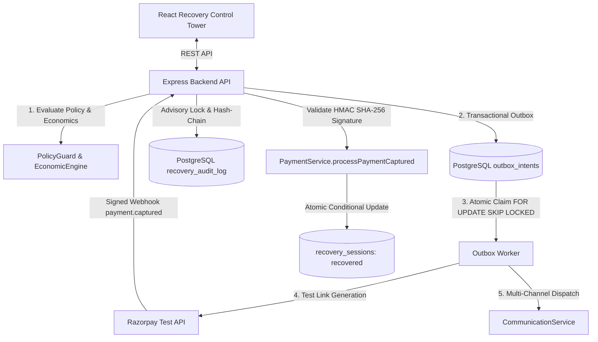

# PayBack-AI 

An enterprise-grade accounts receivable automation platform with an AI Revenue Recovery Engine that detects revenue at risk, determines the right intervention, executes bounded recovery workflows, and measures recovered money across every batch — with compliant escalation, hard stopping rules, a transactional outbox, and a serialized, tamper-evident cryptographic audit ledger.

---

## ⚡ One-Command Verification Workflow

PayBack-AI provides a single command to verify the entire system end-to-end — running compiler AST structural safety bans, live PostgreSQL migrations, all 13 Vitest recovery test suites (71+ automated tests), deterministic evaluation reproducibility, and oracle ceiling self-checks:

```bash
# Run from repository root
python scripts/verify_all.py

# Or via npm from backend:
npm --prefix backend run verify:all
```

**Verification Guarantees (6/6 Passing):**
- `AST Structural Safety Scan`: 0 banned network, execution, or DB imports in AI agents.
- `Vitest Recovery Suites`: 13 test files, 71/71 tests passing (including mid-flight chaos crash force-kill, concurrency race, outbox safety, ledger tampering, PolicyGuard context, Act 3 webhook integrity, merchant policy, responsible contact, and economic engine).
- `Evaluation Batch Generation`: 1,000 simulated Indian business failure cases generated against fixed seed 42.
- `Dynamic A/B Evaluation`: Real execution of multi-agent diagnosis (`RecoveryAgent`, `PaymentRetryAgent`, `MandateSequencerAgent`) and TypeScript `PolicyGuard` stopping rules.
- `Deterministic Reproducibility`: Zero drift across sequential runs against committed baselines.
- `Oracle Ceiling Self-Check`: Automated test asserting Oracle recovery hits exactly 100.00% of theoretical maximum recoverable debt.

---

## 🧠 Codebase Brain & Architecture Specification

For other AI models, automated agents, or engineers seeking a comprehensive deep dive into the whole code structure, invariants, execution boundaries, and database schema, see:

👉 **[brain.md](brain.md)** — Master Architecture, Invariants, 28-Table Schema & Complete Component Map  
👉 **[FAILURES.md](FAILURES.md)** — Honest Post-Mortem & Defects Log (11 production challenges & empirical fixes)

---

## 📈 Proof of Yield: Dual-Denominator Evaluation (Real Code Execution)

We do not merely assert AI recovery; we prove it mathematically by executing the **actual production code**:
1. **Multi-Agent Decision Pipeline**: `RecoveryAgent`, `PaymentRetryAgent`, and `MandateSequencerAgent` analyze observable invoice features to diagnose root cause, select incident lanes, and plan retry schedules.
2. **Deterministic Enforcement Engine**: `PolicyGuard.validate()` in TypeScript (`backend/src/modules/recovery/recovery.contract.ts`) evaluates hard legal stops, opt-outs, dispute freezes, and broken promise limits.
3. **Causal Recovery**: Lane-specific recovery succeeds *only* when the agent's diagnosed lane matches the customer's actual incident lane.

Following the benchmark set by [`piyush2676/recoverx`](https://github.com/piyush2676/recoverx), PayBack-AI evaluates recovery against **two distinct denominators side-by-side**:
- **Total Failed Debt (₹1,789,506.44)**: Traditional gross denominator (includes structurally unrecoverable funds like fraud, closed accounts, and >90-day statutory caps).
- **Oracle Ceiling (₹946,436.57 across 429 cases)**: Theoretical upper bound achievable under perfect ground-truth knowledge adhering strictly to legal guardrails (52.89% of total debt).

*Auto-generated by executing `ai-service/scripts/run_evaluation.py` (`python scripts/verify_all.py`):*

| Arm | Eligible (₹) | Gross Recovered (₹) | % of Total Value | % of Oracle Ceiling | Contacts | Cost (₹) | Net (₹) | Incremental Lift (₹) |
|---|---|---|---|---|---|---|---|---|
| **Control (Do Nothing)** | ₹432,459.06 | ₹72,593.34 | 16.79% | — | 0 | ₹0.00 | ₹72,593.34 | Baseline |
| **Naive (Always Contact)** | ₹1,789,506.44 | ₹580,433.37 | 32.44% | 61.33% | 811 | ₹1,216.50 | ₹579,216.87 | **₹278,827.17** |
| **PayBack-AI Agent** | ₹1,789,506.44 | ₹922,480.72 | **51.55%** | **97.47%** | 956 | ₹1,434.00 | ₹921,046.72 | **₹620,657.02** |
| **Oracle (Perfect Ceiling)** | ₹1,789,506.44 | ₹946,436.57 | 52.89% | **100.00%** | 302 | ₹453.00 | ₹945,983.57 | **₹645,593.87** |

### Agent Diagnostic Intelligence
- **Diagnostic Accuracy**: **85.20%** (691/811 eligible non-holdout cases correctly classified to true incident lane).
- **Oracle Efficiency**: **97.47%** of the theoretical perfect-knowledge ceiling captured.
- **Why It Does Not Clone the Oracle to the Rupee**: On ambiguous cases with generic notifications, diagnostic misclassifications prevent lane remedies from firing, resulting in an honest empirical yield rather than an artificial clairvoyant clone of the Oracle.

### Harness Self-Check Coherence
- **Test**: `ai-service/test/test_oracle_ceiling.py`
- **Assertion**: `oracle_recovered == oracle_ceiling` (100.00% exact match).
- **Guarantee**: The evaluation harness's definition of "recoverable" and its definition of "recovered" are mathematically identical.

---

## 🏆 Key Architectural Differentiators

| Feature | Implementation & Mathematical Proof |
|---|---|
| **Dual-Denominator Yield** | Evaluates against both **Total Failed Value** and **Oracle Ceiling**; includes automated harness self-check (`100.0%` ceiling assertion). |
| **Adversarial Chaos & Crash Resilience** | Proves 0 double-charges and 0 duplicate links under mid-flight worker `process.exit(1)` hard process halts (`chaos-crash.test.ts`). |
| **8 PolicyGuard Stopping Rules** | Hard stops covering settled invoices, STOP opt-outs, active disputes, retry caps, cooldown windows, >90d legal stop, high-value human approval, and economic floor. |
| **Transactional Outbox** | Two-phase dispatch via `recovery_outbox_intents` + `SELECT ... FOR UPDATE SKIP LOCKED` to guarantee exactly-once payment link creation and messaging. |
| **Atomic Tamper-Evident Ledger** | Serialized hash-chain appends via PostgreSQL advisory transaction locks (`pg_advisory_xact_lock`), SHA-256 chain verification, and database immutability guards. |
| **Versioned Merchant Policy** | Dynamic policy loading from `merchant_policies.yaml` validated with Zod, with deterministic SHA-256 `policyHash` stamped on every contract and audit event. |
| **Responsible-Contact Controls** | Timezone-aware quiet hours (21:00–08:00 IST), customer channel preferences, customer-level 24h contact caps, and STOP opt-out propagation across all sessions. |
| **AST-Enforced AI Isolation** | Compiler-level AST inspection (`test_structural_safety.py`) guarantees 0 payment SDKs, HTTP clients, or DB drivers exist in the AI agent layer. |
| **Webhook Truth Boundary** | Executing a recovery action NEVER marks a session recovered; money is recorded strictly upon validated Razorpay `payment.captured` HMAC SHA-256 signed webhook. |

---

## 🏗️ Architecture & Component Trust Boundaries



### Trust Boundaries & Execution Authority

| Layer | Runtime | Authority Level | Can Execute External Actions? | Can Write DB? | Can Touch Money / Razorpay? |
|---|---|---|---|---|---|
| **AI Advisory Layer** (`ai-service/src/agents`) | Python 3.13 / FastAPI | **Read-Only Advisory** | ❌ **NO** (AST banned) | ❌ **NO** (0 DB drivers) | ❌ **NO** (0 Payment SDKs) |
| **Policy Engine** (`backend/src/modules/recovery`) | Node.js / TypeScript | **Deterministic Guard** | ❌ **NO** (Policy evaluator) | ✅ Audit Log & Status | ❌ Enforces stopping rules & floors |
| **Execution Gateway** (`backend/src/modules/payment`) | Node.js / Express | **Authorized Executor** | ✅ **YES** (Outbox claimed) | ✅ Atomic SQL updates | ✅ **YES** (Signed Razorpay webhooks) |
| **PostgreSQL Database** (`backend/src/db/schema.ts`) | PostgreSQL 16 | **Physical Enforcer** | 🔒 Rejects race conditions | 🔒 Unique compound indexes | 🔒 Immutable cryptographic ledger |

---

## 🛡️ Deep Dives: Reliability & Adversarial Correctness

### 1. Mid-Flight Chaos & Force-Kill Crash Testing (`chaos-crash.test.ts`)
Modeled on `piyush2676/recoverx`, we test unexpected worker process termination between "action executed" and "outcome recorded":
- The worker executes payment link generation and **force-kills itself with `process.exit(1)` mid-flight** without committing completion or releasing the lock.
- Resumption tests verify that **0 duplicate links and 0 double charges** occur.
- Reports which active defense layer intercepted the race:
  - **`SESSION_IN_FLIGHT_LOCK`**: Blocked immediate retry attempts while the crashed worker held the session lock.
  - **`IDEMPOTENCY_KEY_UNIQUE_CONSTRAINT`**: PostgreSQL unique constraint on `idempotency_key` (`23505`) suppressed duplicate action intent upon worker reboot.
  - **`STALE_LOCK_SWEEPER`**: Resolved orphaned locks past timeout threshold, escalating to human review with an audit trail.

### 2. Atomic Tamper-Evident Hash Chain Ledger (`verify-ledger.ts`)
Every recovery event produces an immutable, cryptographically chained record in `recovery_audit_log`:
- Appends are serialized per tenant using PostgreSQL transaction-level advisory locks:
  ```sql
  SELECT pg_advisory_xact_lock(hashtext('recovery_ledger_' || tenant_id));
  ```
- Each entry embeds `previous_hash` pointing to the topological head of the tenant's chain, computing:
  $$\text{hash} = \text{SHA256}(\text{previous\_hash} \parallel \text{payload})$$
- Verified under concurrent `Promise.all` bursts in `concurrency-race.test.ts`. Any auditor can verify the database independently:
  ```bash
  npx tsx src/scripts/verify-ledger.ts <tenantId>
  ```

### 3. Transactional Outbox Pattern
To prevent duplicate payment link generation or communication spam during network timeouts or worker crashes:
- Every recovery intent is persisted to `recovery_outbox_intents` with an immutable `idempotency_key` inside the database transaction before calling any external provider.
- Outbox workers atomically claim pending intents using:
  ```sql
  SELECT * FROM recovery_outbox_intents
  WHERE status = 'queued' AND tenant_id = $1
  ORDER BY created_at ASC
  FOR UPDATE SKIP LOCKED
  LIMIT 1;
  ```
- Proven in `outbox-concurrency.test.ts`.

### 4. The 8 Hard PolicyGuard Stopping Rules
Recovery actions are subjected to deterministic, execution-time PolicyGuard checks immediately before dispatch:

| Rule | Trigger Condition | Outcome State | Reason Code |
|---|---|---|---|
| **1. Invoice Settled** | `invoiceStatus IN ('Paid', 'Written Off')` | `escalated` / `recovered` | `INVOICE_SETTLED` |
| **2. Customer Opt-Out** | Debtor sent `STOP` reply keyword | `escalated` | `CUSTOMER_OPTED_OUT` |
| **3. Active Dispute** | Active dispute, chargeback, or refund pending | `escalated` | `DISPUTE_ACTIVE` |
| **4. Max Retries Reached** | Retry count $\ge$ policy max attempts (e.g. 3) | `escalated` | `MAX_ATTEMPTS_EXCEEDED` |
| **5. Cooldown Active** | Elapsed time since last action < cooldown (e.g. 24h) | `escalated` | `COOLDOWN_ACTIVE` |
| **6. 90-Day Overdue Cap** | Invoice `daysOverdue > 90` (statutory ceiling) | `escalated` | `LEGAL_STOP` |
| **7. High-Value Guard** | Amount > approval threshold (e.g. ₹5,00,000) without approval | `escalated` | `HUMAN_APPROVAL_REQUIRED` |
| **8. Economic Floor** | Amount < economic viability floor (e.g. ₹100) | `escalated` | `ECONOMIC_FLOOR_VIOLATION` |

---

## 🛠️ Quick Start & Local Execution

### Prerequisites
- Node.js 20+
- Python 3.11+
- PostgreSQL 16 (or Supabase / RDS connection)

### Setup & Run

```bash
# 1. Clone repository
git clone https://github.com/Adityaa024/PayBack-AI.git
cd PayBack-AI

# 2. Install backend dependencies
cd backend && npm install

# 3. Run database migrations
npm run db:migrate

# 4. Install AI service dependencies
cd ../ai-service && pip install -r requirements.txt

# 5. Run full system verification (1 command, all 6 steps)
cd .. && python scripts/verify_all.py
```

### Environment Variables
Copy `.env.example` to `.env` in `backend/` and `ai-service/`:
- `DATABASE_URL` — PostgreSQL connection string
- `RAZORPAY_KEY_ID` / `RAZORPAY_KEY_SECRET` — Razorpay test keys (`rzp_test_*`)
- `RAZORPAY_WEBHOOK_SECRET` — HMAC secret for payment webhooks
- `ALLOW_IN_MEMORY_FALLBACK` — Defaults to `false` (fail-closed in production)
- `DEMO_MODE` — Defaults to `false` (restricts demo resets)

---

## 📁 Repository Structure

```
.
├── backend/                       # Express + TypeScript + Drizzle ORM
│   ├── src/
│   │   ├── db/                    # PostgreSQL schema (recovery tables, outbox, audit log)
│   │   ├── modules/
│   │   │   ├── recovery/          # Flagship AI Revenue Recovery engine
│   │   │   │   ├── recovery.contract.ts    # RecoveryContract schema & PolicyGuard
│   │   │   │   ├── recovery.service.ts     # Lifecycle orchestration & webhooks
│   │   │   │   ├── recovery.repository.ts  # Advisory locks, ledger & DB operations
│   │   │   │   ├── outbox.service.ts       # Transactional outbox worker
│   │   │   │   ├── economic-engine.ts      # EIV calculation & decile calibration
│   │   │   │   └── recovery.holdout.ts     # 20% Hash-Based Holdout Control Arm
│   │   │   └── policy/
│   │   │       ├── merchant-policy.service.ts   # Versioned YAML policy loader & SHA-256 hasher
│   │   │       └── responsible-contact.service.ts # Quiet hours, channel caps & opt-out
│   │   └── config/env.ts          # Fail-closed operational environment config
│   └── test/modules/recovery/     # 13 comprehensive Vitest test suites (71+ tests)
├── ai-service/                    # Python FastAPI AI service
│   ├── config/
│   │   └── merchant_policies.yaml # Versioned merchant policy configuration source of truth
│   ├── scripts/
│   │   ├── generate_dataset.py    # Synthetic batch dataset generator (fixed seed 42)
│   │   ├── run_evaluation.py      # Evaluation runner (delegates to evaluate-batch.ts)
│   │   ├── verify_reproduce.py    # Deterministic evaluation reproducibility test
│   │   └── world_assumptions.yaml # Documented world assumptions
│   └── test/
│       ├── test_oracle_ceiling.py # Oracle ceiling 100% coherence self-check
│       └── src/test_structural_safety.py # Compiler-level AST import scanner
├── frontend/                      # React SPA (Recovery Control Tower & Analytics)
├── reports/                       # Generated evaluation batches, evaluation.json
├── scripts/
│   └── verify_all.py              # One-command 6-step system verification pipeline
├── brain.md                       # Master architecture, 7 invariants & full code structure
├── EVALUATION.md                  # Real-code dual-denominator empirical report
└── FAILURES.md                    # Defect log and architectural post-mortems (10 entries)
```

---

## ⚖️ Operational Disclaimer

- **Test Mode**: All Razorpay calls use test API credentials (`rzp_test_*`). Real currency is never transferred.
- **Simulated Channels**: Voice negotiations use the browser Web Speech API for interactive demo presentations; SMS and WhatsApp dispatches use sandboxed provider adapters. Email integrates with real SendGrid / SMTP when credentials are provided.
- **Fail-Closed Safety**: In production mode (`ALLOW_IN_MEMORY_FALLBACK=false`), any unavailability of PostgreSQL or advisory locks immediately aborts the recovery workflow, halts external side-effects, and raises an operational alert.
