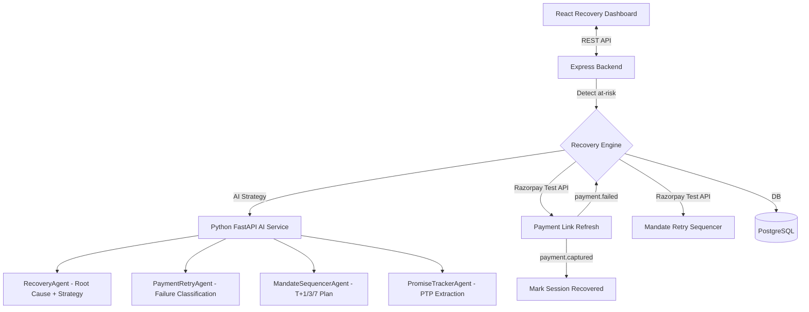
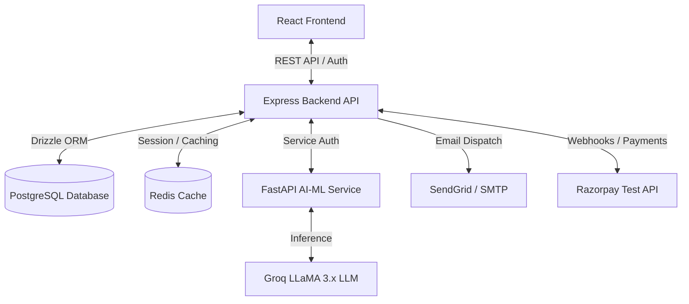

# RecoverIQ — AI Revenue Recovery Platform

**Razorpay Buildathon 2026 — Track 03: AI Revenue Recovery**

An enterprise-grade accounts receivable automation platform with an AI Revenue Recovery Engine that detects revenue at risk, determines the right intervention, executes bounded recovery workflows, and measures recovered money across every batch — with compliant escalation, hard stopping rules, and a full immutable audit trail.

---

## 🏆 Hackathon Highlights

| Criteria | Implementation |
|---|---|
| **A/B Testing & Smart Yield** | Live analytics proving *Incremental Holdout Revenue* vs Treatment cohort |
| **Multi-Channel Stepper** | Visual interactive escalation timeline (Email → SMS → Voice → Internal) |
| **Hackathon Demo Reset** | Instant 1-click database wipe and re-seed for flawless live judging |
| **Voice-First AI Simulation** | Browser-native Hinglish voice negotiation powered by Web Speech API |
| **Measured money recovered** | Real-time ₹ recovered per batch on the Recovery Dashboard |
| **Batch processing** | `POST /api/recovery/run` scans all at-risk invoices and starts sessions |
| **Compliant escalation** | 5-Stage Tone Matrix + Razorpay mandate retry (T+1, T+3, T+7) |
| **Stopping rules** | 6 hard stops: 90-day cap, 3-retry max, PTP-broken-twice, DLQ, mandate-cap, invoice-paid |
| **Audit trail** | Immutable `recovery_audit_log` table with every AI decision + Razorpay ref |
| **Razorpay Test APIs** | Payment links, mandate retry, subscription status, payment.failed webhook |

---

## Recovery Engine Architecture



---

## Recovery Workflows

### 1. Payment Failure → Root Cause → Recovery Action
- Razorpay `payment.failed` webhook automatically triggers a recovery session
- `PaymentRetryAgent` classifies failure (card decline, insufficient funds, network error, etc.)
- Fresh Razorpay payment link generated with 48h expiry for urgency
- Personalized tone-escalated email sent to debtor
- Hard stop after 3 retry attempts → DLQ

### 2. Checkout Abandonment Recovery
- Portal views without payment logged as `checkout_abandonment_signals`
- Recovery session started after 30 minutes of inactivity
- `RecoveryAgent` selects `soft_reminder` or `payment_link_refresh` strategy
- Audit entry created with every action

### 3. Failed Subscription Recovery (Mandate Retry Sequencer)
- `MandateSequencerAgent` plans 3-slot retry: T+24h, T+72h, T+168h
- Each slot calls `Razorpay POST /v1/subscriptions/{id}/retry` (test API)
- Hard stop after all 3 slots exhausted → `human_review` escalation
- Customer notified at each slot with tone-matched message

### 4. B2B Receivables Chase + Promise-to-Pay Tracker
- Overdue invoices scanned every 6 hours for recovery sessions
- Inbound dispute/reply emails analyzed by `PromiseTrackerAgent`
- PTP records created with promised date + amount extracted by LLM
- Daily cron at 10 AM UTC checks for broken promises
- PTP broken ≥2 times → session escalated automatically

### 5. Stopping Rules (Compliant Escalation)

| Condition | Stop Action |
|---|---|
| Days overdue > 90 | Legal Stop — no automated comms |
| Retry count ≥ 3 | DLQ + human review |
| PTP broken ≥ 2 times | Escalate to dispute flow |
| Mandate retries ≥ 3 | Stop mandate sequence |
| Invoice marked Paid | Session closed as `recovered` |
| DLQ threshold reached | Session escalated |

---

## System Architecture



---

## Core Modules

### 1. AI Revenue Recovery Engine (NEW — Razorpay Buildathon)

**Backend (`backend/src/modules/recovery/`)**
- `recovery.repository.ts` — CRUD for 5 new recovery tables
- `recovery.service.ts` — Full lifecycle: detect → strategy → execute → audit → close
- `recovery.controller.ts` / `recovery.routes.ts` — REST API (`/api/recovery/*`)
- Cron: broken-promise check daily at 10 AM UTC

**AI Service (`ai-service/src/agents/`)**
- `recovery_agent.py` — Root cause analysis + strategy selection with hard stopping rules
- `payment_retry_agent.py` — Failure classification + tone-escalated outreach
- `mandate_sequencer_agent.py` — T+1/T+3/T+7 retry planning with 3-attempt cap
- `promise_tracker_agent.py` — LLM extraction of PTP dates and amounts from emails

**Database (5 new tables)**
- `recovery_sessions` — Per-invoice workflow lifecycle
- `payment_retry_attempts` — Per-attempt Razorpay link + status
- `promise_to_pay` — AI-extracted debtor commitments
- `checkout_abandonment_signals` — Portal view without payment events
- `recovery_audit_log` — Immutable append-only action audit trail

**Frontend (`frontend/src/pages/RecoveryDashboard.tsx`)**
- Hero metrics: ₹ at risk, ₹ recovered, recovery rate %, active sessions
- 7-day recovery trend chart (AreaChart)
- Strategy distribution pie chart (AI-selected interventions)
- Session table with per-session audit trail drawer
- Promise-to-Pay tracker tab
- Live audit feed tab
- Stopping rules panel

### 2. Multi-Tenant Backend (backend/)
- **Authentication**: JWT-based session security with bcryptjs and MFA
- **Invoice & Collections**: Automated workflows, 5-Stage Tone Escalation
- **Payment Gateway**: Razorpay adapter — payment links, webhook validation, mandate retry
- **Dead Letter Queue (DLQ)**: Stopping rule enforcement
- **Idempotency Guard**: 20-hour window per invoice

### 3. React SPA Frontend (frontend/)
- **Recovery Dashboard**: Live ₹ recovered, audit trail, strategy charts
- **Dashboard**: At-a-glance revenue at risk callout → links to Recovery
- **Invoice Portal**: Debtor-facing payment portal
- **Agent Controls**: Autopilot run monitoring

### 4. FastAPI AI-ML Engine (ai-service/)
- **Recovery Endpoints**: `/agents/recovery`, `/agents/payment-retry`, `/agents/mandate-sequence`, `/agents/promise-extract`
- **Dispute Agent**: `/agents/dispute`, `/agents/dispute/draft`
- **Risk Scorer**: ML + rule-based default scoring
- **5-Stage Tone Escalation**: Warm → Firm → Serious → Stern → Legal Stop

---

## Razorpay Test API Integrations

| Feature | API Call | Notes |
|---|---|---|
| Recovery payment link | `POST /v1/payment_links` | 48h expiry for urgency |
| Mandate retry | `POST /v1/subscriptions/{id}/retry` | Hard cap: 3 attempts |
| Cancel stale link | `POST /v1/payment_links/{id}/cancel` | Before regenerating |
| Payment failure | `payment.failed` webhook | Auto-triggers recovery |
| Payment success | `payment.captured` webhook | Auto-closes session |

---

## Quick Start

```bash
# Backend
cd backend && npm install && npm run dev

# AI Service
cd ai-service && pip install -r requirements.txt && uvicorn src.api.main:app --reload

# Frontend
cd frontend && npm install && npm run dev
```

**Environment variables** (copy `.env.example` to `.env` in each service):
- `RAZORPAY_KEY_ID` / `RAZORPAY_KEY_SECRET` — test keys (`rzp_test_*`)
- `LLM_API_KEY` — Groq API key
- `DATABASE_URL` — PostgreSQL connection string

---

## Directory Layout

```
.
├── backend/                  # Express + TypeScript + Drizzle ORM API
│   ├── src/
│   │   ├── db/               # PostgreSQL schema (incl. 5 recovery tables)
│   │   ├── modules/
│   │   │   ├── recovery/     # [NEW] Full AI Revenue Recovery module
│   │   │   ├── payment/      # Razorpay adapter (mandate retry + link expiry)
│   │   │   └── agent/        # Autopilot agent + AI-ML bridge
│   │   └── scripts/          # seed-recovery-demo.ts
│   └── migrations/           # Drizzle SQL migrations
├── frontend/                 # React + TypeScript SPA Dashboard
│   ├── src/
│   │   ├── pages/
│   │   │   ├── RecoveryDashboard.tsx  # [NEW] Flagship recovery page
│   │   │   └── Dashboard.tsx          # Updated with revenue-at-risk callout
│   │   └── services/
│   │       └── recovery.ts            # [NEW] Recovery API service
├── ai-service/               # Python FastAPI AI service
│   ├── src/
│   │   ├── agents/
│   │   │   ├── recovery_agent.py          # [NEW]
│   │   │   ├── payment_retry_agent.py     # [NEW]
│   │   │   ├── mandate_sequencer_agent.py # [NEW]
│   │   │   └── promise_tracker_agent.py   # [NEW]
│   │   └── prompts/
│   │       └── recovery_prompt.py         # [NEW]
└── docker-compose.yml
```

---


