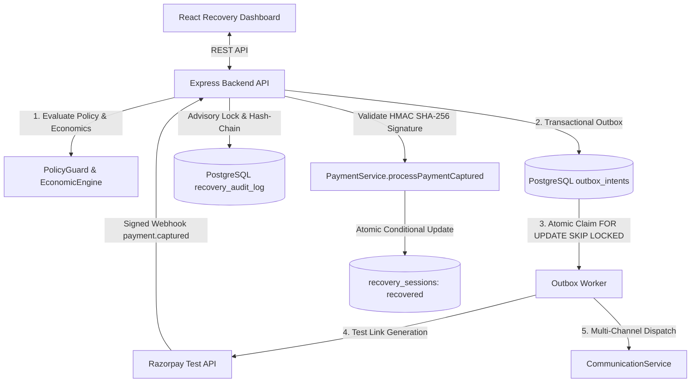

# PayBack-AI 

An enterprise-grade accounts receivable automation platform with an AI Revenue Recovery Engine that detects revenue at risk, determines the right intervention, executes bounded recovery workflows, and measures recovered money across every batch — with compliant escalation, hard stopping rules, a transactional outbox, and a serialized, tamper-evident cryptographic audit ledger.

---

## ⚡ One-Command Verification Workflow

PayBack-AI provides a single command to verify the entire system end-to-end — running compiler AST structural safety bans, live PostgreSQL migrations, all 11 Vitest test suites (67+ automated tests), and deterministic evaluation reproducibility:

```bash
# Run from repository root
python scripts/verify_all.py

# Or via npm from backend:
npm --prefix backend run verify:all
```

**Verification Guarantees:**
- `AST Structural Safety Scan`: 0 banned network, execution, or DB imports in AI agents.
- `Vitest Recovery Suites`: 11 test files, 67/67 tests passing (concurrency, outbox safety, ledger tampering, PolicyGuard context, Act 3 webhook integrity, merchant policy, responsible contact, and economic engine).
- `Deterministic Evaluation`: 1,000 simulated cases evaluated against fixed seed with 0 drift.

---

## 🧠 Codebase Brain & Architecture Specification

For other AI models, automated agents, or engineers seeking a comprehensive deep dive into the whole code structure, invariants, execution boundaries, and database schema, see:

👉 **[brain.md](brain.md)** — Master Architecture, Invariants, 28-Table Schema & Complete Component Map

---

## 📈 Proof of Yield (Evaluation Harness)

We do not merely assert AI recovery; we prove it mathematically. We built a synthetic batch evaluation harness (`ai-service/scripts/run_evaluation.py`) that simulates 1,000 failed invoices under explicit, documented assumptions (`ai-service/scripts/world_assumptions.yaml`). It enforces a strict **20% Hash-Based Holdout Cohort (Control Arm)** to measure *true incremental lift*, not gross recovery.

*Auto-generated from code run (`python scripts/verify_all.py`):*

| Arm | Cases Eligible | Gross Recovered (₹) | Contacts Made | Intervention Cost (₹) | Net Recovered (₹) | Incremental Lift (₹) |
|---|---|---|---|---|---|---|
| **Control (Do Nothing)** | ₹424,846.23 | ₹83,881.46 | 0 | ₹0.00 | ₹83,881.46 | Baseline |
| **Naive (Always Contact)** | ₹1,836,144.56 | ₹572,570.83 | 811 | ₹1,216.50 | ₹571,354.33 | **₹208,826.72** |
| **PayBack-AI Agent** | ₹1,836,144.56 | ₹939,659.81 | 972 | ₹1,458.00 | ₹938,201.81 | **₹575,674.20** |

> **Transparency Note**: The figures above are generated from our synthetic benchmark simulating 1,000 Indian payment failures under assumptions documented in [world_assumptions.yaml](ai-service/scripts/world_assumptions.yaml). Read the full evaluation methodology in [EVALUATION.md](EVALUATION.md) and our honest defect log in [FAILURES.md](FAILURES.md).

---

## 🏆 Key Architectural Differentiators

| Feature | Implementation & Mathematical Proof |
|---|---|
| **Incremental Lift Measurement** | Strict **20% Hash-Based Holdout Control Cohort**; natural organic recoveries are subtracted to report true incremental money. |
| **8 PolicyGuard Stopping Rules** | Hard stops covering settled invoices, STOP opt-outs, active disputes, retry caps, cooldown windows, >90d legal stop, high-value human approval, and economic floor. |
| **Transactional Outbox** | Two-phase dispatch via `recovery_outbox_intents` + `SELECT ... FOR UPDATE SKIP LOCKED` to guarantee exactly-once payment link creation and messaging. |
| **Tamper-Evident Ledger** | Serialized hash-chain appends via PostgreSQL advisory transaction locks (`pg_advisory_xact_lock`), SHA-256 chain verification, and database immutability guards. |
| **Versioned Merchant Policy** | Dynamic policy loading from `merchant_policies.yaml` validated with Zod, with deterministic SHA-256 `policyHash` stamped on every contract and audit event. |
| **Responsible-Contact Controls** | Timezone-aware quiet hours (21:00–08:00 IST), customer channel preferences, customer-level 24h contact caps, and STOP opt-out propagation across all sessions. |
| **Economically Grounded Decisions** | Expected Incremental Value ($EIV = P_{\text{predicted}} \times \text{amount} - \text{costs}$); abstains from unviable interventions and evaluates 10-decile probability calibration. |
| **AST-Enforced AI Isolation** | Compiler-level AST inspection (`test_structural_safety.py`) guarantees 0 payment SDKs, HTTP clients, or DB drivers exist in the AI agent layer. |
| **Webhook Truth Boundary** | Executing a recovery action NEVER marks a session recovered; money is recorded strictly upon validated Razorpay `payment.captured` HMAC SHA-256 signed webhook. |

---

## 🏗️ Architecture & Component Trust Boundaries



### Trust Boundaries & Execution Authority

| Layer | Runtime | Authority Level | Can Execute External Actions? | Can Write DB? | Can Touch Money / Razorpay? |
|---|---|---|---|---|---|
| **AI Advisory Layer** (`ai-service/src/agents`) | Python 3.13 / FastAPI | **Read-Only Advisory** | ❌ **NO** (AST banned) | ❌ **NO** (0 DB drivers) | ❌ **NO** (0 Payment SDKs) |
| **Policy Engine** (`backend/src/modules/recovery`) | Node.js / TypeScript | **Deterministic Guard** | ❌ **NO** (Policy evaluator) | ✅ Audit Log & Status | ❌ Enforces stopping rules & floors |
| **Execution Gateway** (`backend/src/modules/payment`) | Node.js / Express | **Authorized Executor** | ✅ **YES** (Outbox claimed) | ✅ Atomic SQL updates | ✅ **YES** (Signed Razorpay webhooks) |
| **PostgreSQL Database** (`backend/src/db/schema.ts`) | PostgreSQL 16 | **Physical Enforcer** | 🔒 Rejects race conditions | 🔒 Unique compound indexes | 🔒 Immutable cryptographic ledger |

---

## 🛡️ Deep Dives: Reliability & Correctness

### 1. Transactional Outbox Pattern
To prevent duplicate payment link generation or communication spam during network timeouts or worker crashes:
- Every recovery intent is persisted to `recovery_outbox_intents` with an immutable `idempotency_key` inside the database transaction before calling any external provider.
- Outbox workers atomically claim pending intents using:
  ```sql
  SELECT * FROM recovery_outbox_intents
  WHERE status = 'queued' AND tenant_id = $1
  ORDER BY created_at ASC
  FOR UPDATE SKIP LOCKED
  LIMIT 1;
  ```
- If a worker crashes mid-execution, a stale-claim sweeper unlocks the record after timeout without duplicating dispatched side effects. Proven in `outbox-concurrency.test.ts`.

### 2. Tamper-Evident Hash-Chained Audit Ledger
Every recovery action, diagnosis, and state change produces an immutable record in `recovery_audit_log`:
- Appends are serialized per tenant using PostgreSQL transaction-level advisory locks:
  ```sql
  SELECT pg_advisory_xact_lock(hashtext('recovery_ledger_' || tenant_id));
  ```
- Each entry embeds `previous_hash` pointing to the topological head of the tenant's hash chain, computing:
  $$\text{hash} = \text{SHA256}(\text{previous\_hash} \parallel \text{payload})$$
- Repository tamper guards reject any `UPDATE` or `DELETE` on production audit records (`23505` / operational error).
- Demo reset (`POST /api/recovery/reset`) is strictly blocked in production (`ALLOW_DEMO_RESET=false`) and requires admin credentials. Proven in `ledger-tamper.test.ts`.

### 3. The 8 Hard PolicyGuard Stopping Rules
Recovery actions are subjected to deterministic, execution-time PolicyGuard checks immediately before dispatch:

| Rule | Trigger Condition | Outcome State | Reason Code |
|---|---|---|---|
| **1. Invoice Settled** | `invoiceStatus IN ('Paid', 'Written Off')` | `escalated` / `recovered` | `INVOICE_SETTLED` |
| **2. Customer Opt-Out** | Debtor sent `STOP` reply keyword | `escalated` | `CUSTOMER_OPTED_OUT` |
| **3. Active Dispute** | Active dispute, chargeback, or refund pending | `escalated` | `DISPUTE_ACTIVE` |
| **4. Max Retries Reached** | Retry count $\ge$ policy max attempts (e.g. 3) | `escalated` | `MAX_ATTEMPTS_EXCEEDED` |
| **5. Cooldown Active** | Elapsed time since last action < cooldown (e.g. 24h) | `escalated` | `COOLDOWN_ACTIVE` |
| **6. 90-Day Overdue Cap** | Invoice `daysOverdue > 90` (statutory ceiling) | `escalated` | `LEGAL_STOP` |
| **7. High-Value Guard** | Amount > approval threshold (e.g. ₹5,00,000) without approval | `escalated` | `HUMAN_APPROVAL_REQUIRED` |
| **8. Economic Floor** | Amount < economic viability floor (e.g. ₹100) | `escalated` | `ECONOMIC_FLOOR_VIOLATION` |

### 4. Economically Grounded Decision Engine
Interventions must be value-accretive to be scheduled. The `EconomicEngine`:
- Computes Expected Incremental Value:
  $$EIV = (P_{\text{predicted}} \times \text{amountAtRisk}) - (\text{channelCost} + \text{providerCost} + \text{discountCost})$$
- Recommends `'abstain'` when $EIV \le 0$ (intervention costs exceed expected recovery).
- Routes to `'human_review'` when model confidence is below policy threshold ($P < 0.35$) or amount > ₹5,00,000.
- Persists model version (`payback-ai-v1`), prompt version (`v1.2.0`), predicted probability, EIV, and rationale on contracts and audit records.
- Evaluates 10-decile probability calibration computing Expected Calibration Error (ECE) and Brier Score. Proven in `economic-engine.test.ts`.

### 5. Webhook Payment Verification (Act 3 Demo Flow)
- Demo Act 3 generates a fresh Razorpay payment link with 48h expiry in test mode.
- Executing the link **never** marks the session recovered or counts recovered money.
- The platform simulates customer payment through a cryptographically signed `payment.captured` webhook verified via HMAC SHA-256 signature using the configured `RAZORPAY_WEBHOOK_SECRET`.
- Recovered revenue is credited only after the webhook signature passes verification and atomic conditional SQL updates the session state. Proven in `act3-webhook-integrity.test.ts`.

---

## 🛠️ Quick Start & Local Execution

### Prerequisites
- Node.js 20+
- Python 3.11+
- PostgreSQL 16 (or Supabase / RDS connection)

### Setup & Run

```bash
# 1. Clone repository
git clone https://github.com/Adityaa024/PayBack-AI.git
cd PayBack-AI

# 2. Install backend dependencies
cd backend && npm install

# 3. Run database migrations
npm run db:migrate

# 4. Install AI service dependencies
cd ../ai-service && pip install -r requirements.txt

# 5. Run full system verification (1 command)
cd .. && python scripts/verify_all.py
```

### Environment Variables
Copy `.env.example` to `.env` in `backend/` and `ai-service/`:
- `DATABASE_URL` — PostgreSQL connection string
- `RAZORPAY_KEY_ID` / `RAZORPAY_KEY_SECRET` — Razorpay test keys (`rzp_test_*`)
- `RAZORPAY_WEBHOOK_SECRET` — HMAC secret for payment webhooks
- `ALLOW_IN_MEMORY_FALLBACK` — Defaults to `false` (fail-closed in production)
- `DEMO_MODE` — Defaults to `false` (restricts demo resets)

---

## 📁 Repository Structure

```
.
├── backend/                       # Express + TypeScript + Drizzle ORM
│   ├── src/
│   │   ├── db/                    # PostgreSQL schema (recovery tables, outbox, audit log)
│   │   ├── modules/
│   │   │   ├── recovery/          # Flagship AI Revenue Recovery engine
│   │   │   │   ├── recovery.contract.ts    # RecoveryContract schema & PolicyGuard
│   │   │   │   ├── recovery.service.ts     # Lifecycle orchestration & webhooks
│   │   │   │   ├── recovery.repository.ts  # Advisory locks, ledger & DB operations
│   │   │   │   ├── outbox.service.ts       # Transactional outbox worker
│   │   │   │   ├── economic-engine.ts      # EIV calculation & decile calibration
│   │   │   │   └── recovery.holdout.ts     # 20% Hash-Based Holdout Control Arm
│   │   │   └── policy/
│   │   │       ├── merchant-policy.service.ts   # Versioned YAML policy loader & SHA-256 hasher
│   │   │       └── responsible-contact.service.ts # Quiet hours, channel caps & opt-out
│   │   └── config/env.ts          # Fail-closed operational environment config
│   └── test/modules/recovery/     # 11 comprehensive Vitest test suites (67+ tests)
├── ai-service/                    # Python FastAPI AI service
│   ├── config/
│   │   └── merchant_policies.yaml # Versioned merchant policy configuration source of truth
│   ├── scripts/
│   │   ├── generate_dataset.py    # Synthetic batch dataset generator (fixed seed 42)
│   │   ├── run_evaluation.py      # Empirical A/B evaluation report generator
│   │   ├── verify_reproduce.py    # Deterministic evaluation reproducibility test
│   │   └── world_assumptions.yaml # Documented world assumptions
│   └── test/src/
│       └── test_structural_safety.py # Compiler-level AST import scanner
├── frontend/                      # React SPA (Recovery Control Tower & Analytics)
├── reports/                       # Generated evaluation batches and json metrics
├── scripts/
│   └── verify_all.py              # One-command system verification pipeline
├── brain.md                       # Master architecture, 7 invariants & full code structure
├── EVALUATION.md                  # Auto-generated empirical A/B evaluation report
└── FAILURES.md                    # Defect log and architectural post-mortems
```

---

## ⚖️ Operational Disclaimer

- **Test Mode**: All Razorpay calls use test API credentials (`rzp_test_*`). Real currency is never transferred.
- **Simulated Channels**: Voice negotiations use the browser Web Speech API for interactive demo presentations; SMS and WhatsApp dispatches use sandboxed provider adapters. Email integrates with real SendGrid / SMTP when credentials are provided.
- **Fail-Closed Safety**: In production mode (`ALLOW_IN_MEMORY_FALLBACK=false`), any unavailability of PostgreSQL or advisory locks immediately aborts the recovery workflow, halts external side-effects, and raises an operational alert.
