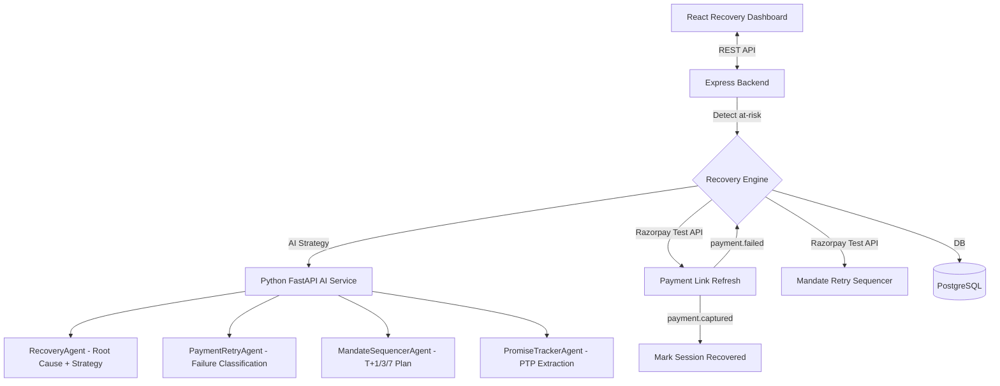
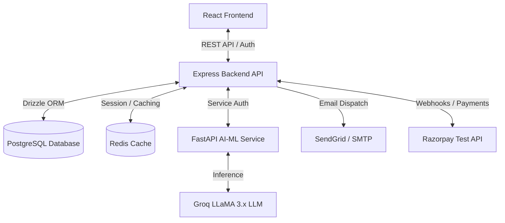

# RecoverIQ — AI Revenue Recovery Platform


An enterprise-grade accounts receivable automation platform with an AI Revenue Recovery Engine that detects revenue at risk, determines the right intervention, executes bounded recovery workflows, and measures recovered money across every batch — with compliant escalation, hard stopping rules, and a full immutable audit trail.

---

## 📈 Proof of Yield (Evaluation Harness)

We don't just claim AI recovery; we prove it mathematically. We built a synthetic batch evaluation harness (`ai-service/scripts/run_evaluation.py`) that simulates 1000 failed invoices. It enforces a strict **20% Hash-Based Holdout Cohort (Control Arm)** to measure _true incremental lift_.

| Arm                        | Cases Eligible | Contacts Made | Intervention Cost | Net Recovered | Incremental Lift |
| -------------------------- | -------------- | ------------- | ----------------- | ------------- | ---------------- |
| **Control (Do Nothing)**   | ₹424,846       | 0             | ₹0.00             | ₹83,881       | Baseline         |
| **Naive (Always Contact)** | ₹1,836,144     | 811           | ₹1,216.50         | ₹571,354      | **₹208,826**     |
| **PayBack-AI Agent**       | ₹1,836,144     | 972           | ₹1,458.00         | ₹938,201      | **₹575,674**     |

PayBack-AI yields the highest **Incremental Lift** because it uses smart tone escalation and routing, while strictly obeying 7 hard stopping rules and an Economic Floor Guard. Read the full evaluation methodology in [EVALUATION.md](EVALUATION.md) and our honest bug log in [FAILURES.md](FAILURES.md).

---

## 🏆 Hackathon Highlights

| Criteria                      | Implementation                                                                          |
| ----------------------------- | --------------------------------------------------------------------------------------- |
| **A/B Testing & Smart Yield** | Live analytics proving _Incremental Holdout Revenue_ vs Treatment cohort                |
| **Multi-Channel Stepper**     | Visual interactive escalation timeline (Email → SMS → Voice → Internal)                 |
| **Hackathon Demo Reset**      | Instant 1-click database wipe and re-seed for flawless live judging                     |
| **Voice-First AI Simulation** | Browser-native Hinglish voice negotiation powered by Web Speech API                     |
| **Measured money recovered**  | Real-time ₹ recovered per batch on the Recovery Dashboard                               |
| **Batch processing**          | `POST /api/recovery/run` scans all at-risk invoices and starts sessions                 |
| **Compliant escalation**      | 5-Stage Tone Matrix + Razorpay mandate retry (T+1, T+3, T+7)                            |
| **Stopping rules**            | 7 hard stops + Economic Floor (< ₹100), explicit escalated transitions, audit reasons |
| **Concurrency & Idempotency** | At-most-once execution proven by live adversarial Postgres tests (`concurrency.test.ts`) |
| **AST-Enforced AI Isolation** | Zero payment SDKs, HTTP clients, or DB drivers imported in AI agent layer                |
| **Audit trail**               | Immutable `recovery_audit_log` table with every AI decision + Razorpay ref              |
| **Hash-Chained Ledger**       | Cryptographic sequence verification (`verify-ledger.ts`) to prevent tampering           |
| **Merchant YAML Policy**      | Absolute control via `ai-service/config/merchant_policies.yaml` (Differentiator)        |
| **Razorpay Test APIs**        | Payment links, mandate retry, subscription status, payment.failed webhook               |

---

## Recovery Engine Architecture



---

## Recovery Workflows

### 1. Payment Failure → Root Cause → Recovery Action

- Razorpay `payment.failed` webhook automatically triggers a recovery session
- `PaymentRetryAgent` classifies failure (card decline, insufficient funds, network error, etc.)
- Fresh Razorpay payment link generated with 48h expiry for urgency
- Personalized tone-escalated email sent to debtor
- Hard stop after 3 retry attempts → DLQ

### 2. Checkout Abandonment Recovery

- Portal views without payment logged as `checkout_abandonment_signals`
- Recovery session started after 30 minutes of inactivity
- `RecoveryAgent` selects `soft_reminder` or `payment_link_refresh` strategy
- Audit entry created with every action

### 3. Failed Subscription Recovery (Mandate Retry Sequencer)

- `MandateSequencerAgent` plans 3-slot retry: T+24h, T+72h, T+168h
- Each slot calls `Razorpay POST /v1/subscriptions/{id}/retry` (test API)
- Hard stop after all 3 slots exhausted → `human_review` escalation
- Customer notified at each slot with tone-matched message

### 4. B2B Receivables Chase + Promise-to-Pay Tracker

- Overdue invoices scanned every 6 hours for recovery sessions
- Inbound dispute/reply emails analyzed by `PromiseTrackerAgent`
- PTP records created with promised date + amount extracted by LLM
- Daily cron at 10 AM UTC checks for broken promises
- PTP broken ≥2 times → session escalated automatically

### 5. Stopping Rules (Compliant Escalation & Economic Guard)

All stopping rules strictly transition active sessions to an explicit `escalated` status with machine-readable reasons and immutable audit log entries (no silent drops or missing states):

| Condition | Stop Action | Transition State | Audit Action / Reason |
| :--- | :--- | :--- | :--- |
| **Days overdue > 90** | Legal Stop — suppress automated comms | `escalated` | `session_escalated_legal_stop` |
| **Retry count ≥ 3** | Exhausted attempts — human review | `escalated` | `session_escalated_max_retries` |
| **PTP broken ≥ 2 times** | Broken commitment twice | `escalated` | `escalated_ptp_broken_twice` |
| **Mandate retries ≥ 3** | Subscription mandate capped | `escalated` | `session_escalated_max_retries` |
| **Invoice marked Paid** | Payment settled via webhook | `recovered` | `session_recovered` |
| **Economic Floor (< ₹100)** | Invoiced amount below economic threshold | `escalated` | `session_escalated_economic_floor` |
| **Stale Lock Timeout** | Worker crashed mid-execution (>15m) | `escalated` | `stale_lock_timeout` |

---

## 🛡️ Concurrency, Idempotency & Trust Boundaries (Proven Guarantees)

Most hackathon submissions claim "the LLM cannot touch money" in prose. PayBack-AI physically enforces it at the compiler, network, and database layers, backed by **adversarial concurrency tests** executed against PostgreSQL.

Detailed architecture and threat models can be reviewed in [docs/ARCHITECTURE.md](docs/ARCHITECTURE.md).

### 1. Component Trust Boundaries

| Layer | Runtime | Authority Level | Can Execute Actions? | Can Write DB? | Can Touch Money / Razorpay? |
| :--- | :--- | :--- | :--- | :--- | :--- |
| **AI Advisory Layer** (`ai-service/src/agents`) | Python 3.13 / FastAPI | **Read-Only Advisory** | ❌ **NO** (AST banned) | ❌ **NO** (0 DB drivers) | ❌ **NO** (0 Payment SDKs) |
| **Policy Engine** (`backend/src/modules/recovery`) | Node.js / TypeScript | **Deterministic Guard** | ❌ **NO** (Policy evaluator) | ✅ Audit Log & Status | ❌ Enforces stopping rules & floors |
| **Execution Gateway** (`backend/src/modules/payment`) | Node.js / Express | **Authorized Executor** | ✅ **YES** (PolicyGuard approved) | ✅ Atomic SQL updates | ✅ **YES** (Signed Razorpay webhooks) |
| **PostgreSQL Database** (`backend/src/db/schema.ts`) | PostgreSQL 16 | **Physical Enforcer** | 🔒 Rejects race conditions | 🔒 Unique compound indexes | 🔒 Immutable cryptographic ledger |

### 2. AST-Enforced Import Bans
The AI service codebase is statically scanned at test time (`ai-service/test/src/test_structural_safety.py`) using Python's `ast` module. The presence of any network request library (`requests`, `httpx`, `aiohttp`, `urllib`), database driver (`sqlalchemy`, `psycopg2`, `asyncpg`, `sqlite3`), or payment provider SDK (`razorpay`, `stripe`) instantly fails CI:
```bash
python ai-service/test/src/test_structural_safety.py
# Output: PASS: Structural safety verified — 0 banned execution/DB imports in AI agents.
```

### 3. Adversarial Concurrency Test Suite
We ship live adversarial tests (`backend/test/modules/recovery/concurrency.test.ts`) that execute real concurrent operations against PostgreSQL to prove at-most-once semantics:

```bash
npm --prefix backend test/modules/recovery/concurrency.test.ts
```

- **Test 1: 10 Concurrent Duplicate Webhooks via `Promise.all`**
  Simulates a payment gateway firing 10 identical webhook deliveries simultaneously during network jitter.
  *Guaranteed Result:* Exactly **1** webhook processes, exactly **1** DB status changes to `recovered`, exactly **1** audit entry is written. The remaining **9** are rejected as duplicate deliveries via atomic conditional SQL:
  ```sql
  UPDATE recovery_sessions 
  SET status = 'recovered', amount_recovered = $1, resolved_at = NOW() 
  WHERE tenant_id = $2 AND invoice_id = $3 AND status != 'recovered' 
  RETURNING id;
  ```
- **Test 2: Double-Dispatch Race Condition**
  Simulates two worker nodes attempting to execute the same retry attempt number concurrently.
  *Guaranteed Result:* PostgreSQL physically rejects the second attempt with error `23505` via compound unique constraint:
  ```sql
  CREATE UNIQUE INDEX payment_retry_attempts_session_attempt_uniq 
  ON payment_retry_attempts (session_id, attempt_number);
  ```
- **Test 3: Crashed Worker & Stale In-Flight Lock Recovery**
  Simulates a worker dying abruptly while holding an active recovery session lock.
  *Guaranteed Result:* Background lock sweeper detects sessions locked longer than 15 minutes, safely clears `locked_at = NULL`, and transitions the session to `escalated` with `stale_lock_timeout` for operator audit.

### 4. Human-in-the-Loop Escalated Visibility
Escalated sessions never disappear into a silent black hole. The frontend dashboard (`frontend/src/pages/RecoveryDashboard.tsx`) features a real-time **⚠️ Escalated / Human Review** filter pill showing live session counts, failure reasons, and quick access to manual collections.

---

## System Architecture



---

## Core Modules

### 1. AI Revenue Recovery Engine (NEW — Razorpay Buildathon)

**Backend (`backend/src/modules/recovery/`)**

- `recovery.repository.ts` — CRUD for 5 new recovery tables
- `recovery.service.ts` — Full lifecycle: detect → strategy → execute → audit → close
- `recovery.controller.ts` / `recovery.routes.ts` — REST API (`/api/recovery/*`)
- Cron: broken-promise check daily at 10 AM UTC

**AI Service (`ai-service/src/agents/`)**

- `recovery_agent.py` — Root cause analysis + strategy selection with hard stopping rules
- `payment_retry_agent.py` — Failure classification + tone-escalated outreach
- `mandate_sequencer_agent.py` — T+1/T+3/T+7 retry planning with 3-attempt cap
- `promise_tracker_agent.py` — LLM extraction of PTP dates and amounts from emails

**Database (5 new tables)**

- `recovery_sessions` — Per-invoice workflow lifecycle
- `payment_retry_attempts` — Per-attempt Razorpay link + status
- `promise_to_pay` — AI-extracted debtor commitments
- `checkout_abandonment_signals` — Portal view without payment events
- `recovery_audit_log` — Immutable append-only action audit trail

**Frontend (`frontend/src/pages/RecoveryDashboard.tsx`)**

- Hero metrics: ₹ at risk, ₹ recovered, recovery rate %, active sessions
- 7-day recovery trend chart (AreaChart)
- Strategy distribution pie chart (AI-selected interventions)
- Session table with per-session audit trail drawer
- Promise-to-Pay tracker tab
- Live audit feed tab
- Stopping rules panel

### 2. Multi-Tenant Backend (backend/)

- **Authentication**: JWT-based session security with bcryptjs and MFA
- **Invoice & Collections**: Automated workflows, 5-Stage Tone Escalation
- **Payment Gateway**: Razorpay adapter — payment links, webhook validation, mandate retry
- **Dead Letter Queue (DLQ)**: Stopping rule enforcement
- **Idempotency Guard**: 20-hour window per invoice

### 3. React SPA Frontend (frontend/)

- **Recovery Dashboard**: Live ₹ recovered, audit trail, strategy charts
- **Dashboard**: At-a-glance revenue at risk callout → links to Recovery
- **Invoice Portal**: Debtor-facing payment portal
- **Agent Controls**: Autopilot run monitoring

### 4. FastAPI AI-ML Engine (ai-service/)

- **Recovery Endpoints**: `/agents/recovery`, `/agents/payment-retry`, `/agents/mandate-sequence`, `/agents/promise-extract`
- **Dispute Agent**: `/agents/dispute`, `/agents/dispute/draft`
- **Risk Scorer**: ML + rule-based default scoring
- **5-Stage Tone Escalation**: Warm → Firm → Serious → Stern → Legal Stop

---

## Razorpay Test API Integrations

| Feature               | API Call                             | Notes                  |
| --------------------- | ------------------------------------ | ---------------------- |
| Recovery payment link | `POST /v1/payment_links`             | 48h expiry for urgency |
| Mandate retry         | `POST /v1/subscriptions/{id}/retry`  | Hard cap: 3 attempts   |
| Cancel stale link     | `POST /v1/payment_links/{id}/cancel` | Before regenerating    |
| Payment failure       | `payment.failed` webhook             | Auto-triggers recovery |
| Payment success       | `payment.captured` webhook           | Auto-closes session    |

---

## Quick Start

```bash
# Backend
cd backend && npm install && npm run dev

# AI Service
cd ai-service && pip install -r requirements.txt && uvicorn src.api.main:app --reload

# Frontend
cd frontend && npm install && npm run dev
```

**Environment variables** (copy `.env.example` to `.env` in each service):

- `RAZORPAY_KEY_ID` / `RAZORPAY_KEY_SECRET` — test keys (`rzp_test_*`)
- `LLM_API_KEY` — Groq API key
- `DATABASE_URL` — PostgreSQL connection string

---

## Directory Layout

```
.
├── backend/                  # Express + TypeScript + Drizzle ORM API
│   ├── src/
│   │   ├── db/               # PostgreSQL schema (incl. 5 recovery tables)
│   │   ├── modules/
│   │   │   ├── recovery/     # [NEW] Full AI Revenue Recovery module
│   │   │   ├── payment/      # Razorpay adapter (mandate retry + link expiry)
│   │   │   └── agent/        # Autopilot agent + AI-ML bridge
│   │   └── scripts/          # seed-recovery-demo.ts
│   └── migrations/           # Drizzle SQL migrations
├── frontend/                 # React + TypeScript SPA Dashboard
│   ├── src/
│   │   ├── pages/
│   │   │   ├── RecoveryDashboard.tsx  # [NEW] Flagship recovery page
│   │   │   └── Dashboard.tsx          # Updated with revenue-at-risk callout
│   │   └── services/
│   │       └── recovery.ts            # [NEW] Recovery API service
├── ai-service/               # Python FastAPI AI service
│   ├── src/
│   │   ├── agents/
│   │   │   ├── recovery_agent.py          # [NEW]
│   │   │   ├── payment_retry_agent.py     # [NEW]
│   │   │   ├── mandate_sequencer_agent.py # [NEW]
│   │   │   └── promise_tracker_agent.py   # [NEW]
│   │   └── prompts/
│   │       └── recovery_prompt.py         # [NEW]
└── docker-compose.yml
```

---
