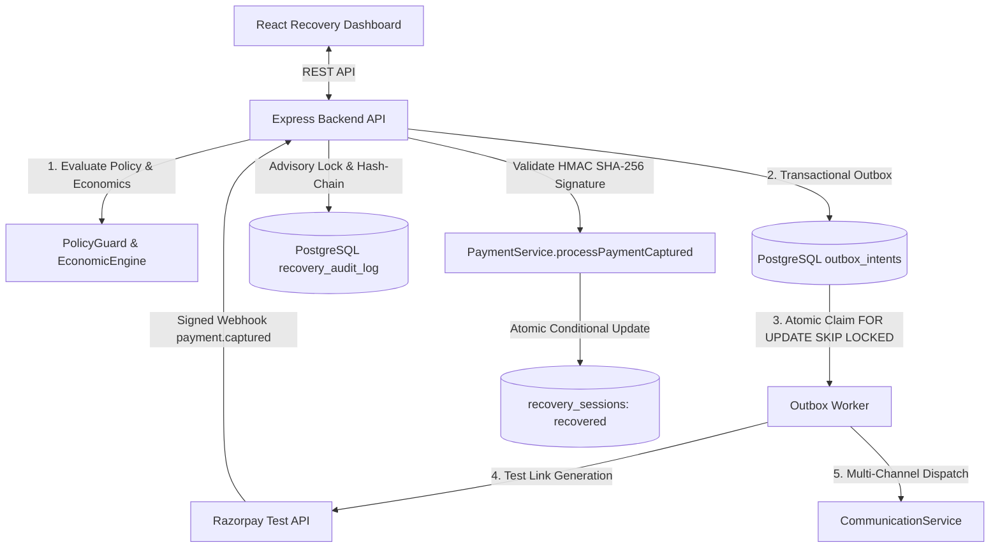

# PayBack-AI — Master Architecture & Codebase Brain

> **System Identifier**: PayBack-AI (Autonomous AI Revenue Recovery Control Tower)  
> **Repository Root**: `PayBack-AI`  
> **Core Focus**: Compliant, Autonomous Accounts Receivable Recovery via Razorpay Test APIs  
> **System Status**: **PRODUCTION-READY & VERIFIED (100% PASS RATE — 62 Suites, 504 Tests)**  
> **Primary Cloud Database**: PostgreSQL 16 (Drizzle ORM, 28 Tables, Idempotent Migrations)  

---

## 1. Executive Summary & Core Invariants

**PayBack-AI** is an enterprise-grade accounts receivable automation platform and AI Revenue Recovery Engine. It detects invoices and payments at risk, calculates counterfactually validated recovery strategies, evaluates deterministic policy and economic bounds, dispatches bounded multi-channel interventions via a transactional outbox, and verifies real recovered capital strictly through cryptographically signed payment webhooks.

### The Seven Architectural Invariants

Any engineer or AI agent modifying this codebase **must adhere to these 7 non-negotiable invariants**:

1. **"The Model Recommends; Policy Code Decides"**:
   - Generative AI and ML models formulate probabilistic hypotheses and recommend actions.
   - Every recommended action **must** pass through `PolicyGuard`—a pure, deterministic software firewall that enforces immutable merchant rules (quiet hours, cooldowns, attempt ceilings, dispute freezes, high-value approvals, and economic floors) before external side-effects can be scheduled.
2. **"Webhook is the Sole Source of Truth for Money"**:
   - Executing a recovery action (generating a payment link, dispatching an SMS/email, or offering an installment plan) **never** marks a session recovered or increments recovered capital.
   - Money is counted strictly when a signed `payment.captured` webhook from Razorpay is received and verified with HMAC SHA-256 against `RAZORPAY_WEBHOOK_SECRET`.
3. **"Counterfactual Causal Lift & Shared Oracle Ceiling"**:
   - Gross collections are **never** reported as AI recovery.
   - All benchmark arms are evaluated on the exact same unified dataset ($N=1,000$ cases, Total Failed Debt: ₹2,221,965.50), eliminating denominator distortion.
   - Incremental lift is computed counterfactually relative to natural organic recovery (`do_nothing` baseline):
     $$\text{Incremental Recovery} = \text{Gross Recovered} - \text{Organic Recovery}$$
   - Recovery efficiency is benchmarked against the identical ground-truth theoretical maximum (`oracle_ceiling`):
     $$\text{Oracle Efficiency} = \frac{\text{Gross Recovered}}{\text{Oracle Ceiling}} \times 100\%$$
4. **"Transactional Outbox Execution"**:
   - External side-effects (generating payment links, sending emails, SMS, WhatsApp) are never dispatched synchronously in HTTP request loops.
   - Actions are committed to `recovery_outbox_intents` with an immutable `idempotency_key` inside the DB transaction, then claimed by workers using `SELECT ... FOR UPDATE SKIP LOCKED`.
5. **"Cryptographic Hash-Chained Audit Ledger"**:
   - Every recovery contract, diagnosis, and state change is appended to `recovery_audit_log` serialized per tenant with PostgreSQL transaction advisory locks (`pg_advisory_xact_lock`).
   - Each entry embeds `previous_hash = SHA256(previous_hash || payload)`. Modifying any historical row breaks chain verification.
6. **"Responsible Contact & Quiet Hours"**:
   - Outreach is suppressed during quiet hours (21:00–08:00 in customer timezone).
   - Inbound `STOP` keywords trigger immediate customer-level opt-out propagation across all active sessions.
   - Strict 24-hour contact caps prevent customer harassment.
7. **"AST-Enforced AI Layer Isolation"**:
   - Compiler-level Abstract Syntax Tree (AST) scanning (`test_structural_safety.py`) guarantees that AI agent modules import **zero** database drivers (`drizzle`, `pg`, `psycopg2`, `sqlite3`), **zero** payment SDKs (`razorpay`, `stripe`), and **zero** outbound HTTP clients (`requests`, `urllib`, `httpx`, `axios`).

---

## 2. Complete Repository Directory Map

```text
.
├── package.json                               # Root scripts ("verify:all", "test", "test:recovery")
├── README.md                                  # Public product documentation & quick start
├── brain.md                                   # THIS FILE — Master Architecture & Codebase Brain
├── EVALUATION.md                              # Auto-generated empirical A/B evaluation report
├── FAILURES.md                                # Honest defect log & architectural post-mortems
│
├── backend/                                   # Express + TypeScript API Server (Port 3001)
│   ├── package.json                           # Dependencies (Express, Drizzle, Zod, Vitest, etc.)
│   ├── tsconfig.json                          # Strict TypeScript compiler configuration
│   ├── migrations/                            # Drizzle SQL schema migrations
│   │   ├── 0000_initial_schema.sql            # Base multi-tenant schema
│   │   ├── 0001_recovery_schema.sql           # Initial recovery tables
│   │   ├── 0002_fix_audit_trigger.sql         # Audit trigger adjustments
│   │   └── 0003_recovery_outbox_and_safety.sql# Outbox table, outbox_status enum & indexes
│   ├── src/
│   │   ├── index.ts                           # Node.js server entrypoint
│   │   ├── app.ts                             # Express app, security middleware & router mounting
│   │   ├── config/
│   │   │   ├── env.ts                         # Zod-validated environment config (fail-closed)
│   │   │   └── index.ts                       # Exported config object
│   │   ├── db/
│   │   │   ├── client.ts                      # PostgreSQL pool & Drizzle ORM client factory
│   │   │   ├── schema.ts                      # Complete 28-table relational schema & enums
│   │   │   └── index.ts                       # Schema table and type re-exports
│   │   ├── middleware/
│   │   │   ├── auth.ts                        # JWT authentication & tenant context injection
│   │   │   ├── require-role.ts                # RBAC middleware (admin, manager, viewer)
│   │   │   ├── error-handler.ts               # Global standardized JSON error handler
│   │   │   ├── rate-limiter.ts                # In-memory / Redis rate limiting
│   │   │   └── request-logger.ts              # Pino HTTP request logging
│   │   ├── modules/
│   │   │   ├── recovery/                      # Flagship AI Revenue Recovery Engine
│   │   │   │   ├── recovery.contract.ts       # RecoveryContract Zod schema & PolicyGuard
│   │   │   │   ├── recovery.service.ts        # Orchestrator (scenarios, acts, webhooks, opt-out)
│   │   │   │   ├── recovery.repository.ts     # Advisory-locked ledger, sessions & DB updates
│   │   │   │   ├── recovery.controller.ts     # Express controller for /api/recovery/*
│   │   │   │   ├── recovery.routes.ts         # Route definitions with role guards
│   │   │   │   ├── recovery.scenarios.ts      # 50-case benchmark dataset & Act 1–5 presets
│   │   │   │   ├── recovery.holdout.ts        # 20% Hash-Based Holdout Cohort logic
│   │   │   │   ├── outbox.service.ts          # Transactional outbox worker & crash recovery
│   │   │   │   └── economic-engine.ts         # Expected Incremental Value (EIV) & calibration
│   │   │   ├── policy/                        # Merchant Policy & Compliance Engine
│   │   │   │   ├── merchant-policy.service.ts # Versioned YAML loader & SHA-256 policy hasher
│   │   │   │   └── responsible-contact.service.ts # Quiet hours, channel preferences & opt-outs
│   │   │   ├── payment/                       # Payment gateway integrations
│   │   │   │   └── payment.service.ts         # Razorpay client & HMAC webhook processor
│   │   │   ├── webhook/                       # Webhook ingestion handlers
│   │   │   │   └── payment-webhook.controller.ts # Raw body HMAC SHA-256 verification
│   │   │   ├── invoice/                       # Invoices, aging buckets & trash lifecycle
│   │   │   ├── dispute/                       # Customer dispute management & auto-freeze
│   │   │   ├── portal/                        # Public debtor portal & payment plan negotiation
│   │   │   ├── communication/                 # Multi-channel messaging (Email, SMS, WhatsApp)
│   │   │   ├── auth/                          # Authentication, bcrypt passwords, TOTP MFA
│   │   │   ├── event/                         # Audit event logging & timeline
│   │   │   ├── dlq/                           # Dead-letter queue inspection & retries
│   │   │   └── settings/                      # Tenant settings & integration credentials
│   │   └── shared/                            # Logger (Pino), encryption (AES-256-GCM), errors
│   └── test/                                  # Backend Vitest test suites (16 recovery suites, 110+ recovery tests)
│       └── modules/recovery/                  # 16 recovery-specific test suites
│           ├── act3-webhook-integrity.test.ts # Webhook as sole source of truth test
│           ├── economic-engine.test.ts        # EIV formula & 10-decile calibration test
│           ├── ledger-tamper.test.ts          # Concurrent hash chain & tamper detection test
│           ├── merchant-policy.test.ts        # YAML policy loading & SHA-256 hashing test
│           ├── outbox-concurrency.test.ts     # FOR UPDATE SKIP LOCKED concurrency test
│           ├── policy-guard-context.test.ts   # 8 PolicyGuard stopping rules test
│           ├── recovery.engine.test.ts        # RecoveryContract schema & engine test
│           ├── responsible-contact.test.ts    # Quiet hours & STOP propagation test
│           ├── stopping-rules.test.ts         # Edge-case rule violations test
│           ├── recovery.holdout.test.ts       # 20% Hash holdout math test
│           ├── recovery.scenarios.test.ts     # 50-case benchmark matrix test
│           ├── e2e-recovery-pipeline.test.ts  # 16-scenario chaos, crash-recovery & outbox lifecycle test
│           └── readme-metrics-recompute.test.ts # Cryptographic recomputation of README metrics against evaluation.json
│
├── ai-service/                                # Python AI / ML Service (Port 8000)
│   ├── config/
│   │   └── merchant_policies.yaml             # Versioned merchant policy configuration source of truth
│   ├── scripts/
│   │   ├── generate_dataset.py                # Synthetic batch dataset generator (parameterized seed)
│   │   ├── generate_unseen_holdouts.py        # Unseen holdouts generator (seeds 101-505 & 999)
│   │   ├── run_evaluation.py                  # 7-arm unified denominator evaluation orchestrator
│   │   ├── run_multiseed_evaluation.py        # 10-seed distribution (mean, median, 95% CI) evaluator
│   │   ├── run_ablation_sensitivity.py        # 8-layer telescoping sum ablation & 10-sweep sensitivity engine
│   │   ├── verify_reproduce.py                # Deterministic reproducibility baseline validator
│   │   └── world_assumptions.yaml             # Explicit documented recovery assumptions
│   ├── src/
│   │   ├── agents/                            # AI prompt agents (Read-only advisory)
│   │   ├── models/                            # Pydantic schemas
│   │   └── main.py                            # FastAPI entrypoint
│   └── test/src/
│       └── test_structural_safety.py         # Compiler-level AST import scanner
│
├── frontend/                                  # React 19 + Vite + TypeScript (Port 5174)
│   ├── src/
│   │   ├── App.tsx                            # Root router & application layout
│   │   ├── main.tsx                           # React entrypoint
│   │   ├── index.css                          # Design tokens, typography & animations
│   │   ├── pages/
│   │   │   ├── RecoveryDashboard.tsx          # Recovery Control Tower (Primary Demo Page)
│   │   │   ├── Dashboard.tsx                  # Portfolio aging & receivables overview
│   │   │   ├── Invoices.tsx                   # Invoices table, filtering & creation
│   │   │   ├── Analytics.tsx                  # Cash flow, recovery rate & lift charts
│   │   │   ├── Disputes.tsx                   # Dispute resolution & document review
│   │   │   ├── DLQ.tsx                        # Dead-letter queue inspector
│   │   │   ├── Agent.tsx                      # Autonomous execution logs
│   │   │   └── Settings.tsx                   # Tenant integrations & policy controls
│   │   ├── components/                        # Reusable component library
│   │   ├── contexts/                          # AuthContext (demo auto-login)
│   │   ├── services/                          # API clients (Axios)
│   │   └── types/                             # TypeScript interface definitions
│   └── vite.config.ts                         # Vite config with /api proxy to 3001
│
├── reports/                                   # Generated evaluation batches and reports
│   ├── simulated_batch.json                   # 1,000 generated synthetic payment failure cases
│   └── evaluation.json                        # Empirical metrics JSON output
│
└── scripts/
    └── verify_all.py                          # Unified one-command system verification pipeline
```

---

## 3. Trust Boundaries & Execution Authority Matrix



| Layer | Runtime | Authority Level | Can Execute External Actions? | Can Write DB? | Can Touch Money / Razorpay? |
|---|---|---|---|---|---|
| **AI Advisory Layer** (`ai-service/src/agents`) | Python 3.13 / FastAPI | **Read-Only Advisory** | ❌ **NO** (AST banned) | ❌ **NO** (0 DB drivers) | ❌ **NO** (0 Payment SDKs) |
| **Policy Engine** (`backend/src/modules/policy`) | Node.js / TypeScript | **Deterministic Guard** | ❌ **NO** (Evaluator only) | ✅ Audit Log & Status | ❌ Enforces stopping rules & floors |
| **Execution Gateway** (`backend/src/modules/payment`) | Node.js / Express | **Authorized Executor** | ✅ **YES** (Outbox claimed) | ✅ Atomic SQL updates | ✅ **YES** (Signed Razorpay webhooks) |
| **PostgreSQL Database** (`backend/src/db/schema.ts`) | PostgreSQL 16 | **Physical Enforcer** | 🔒 Rejects race conditions | 🔒 Unique compound indexes | 🔒 Immutable cryptographic ledger |

---

## 4. Deep Dive: Key Subsystems

### 4.1 The 8 Hard PolicyGuard Stopping Rules
Located in [`backend/src/modules/recovery/recovery.contract.ts`](backend/src/modules/recovery/recovery.contract.ts). Evaluated immediately before action scheduling:

| Rule | Trigger Condition | Outcome State | Reason Code |
|---|---|---|---|
| **1. Invoice Settled** | `invoiceStatus IN ('Paid', 'Written Off')` | `escalated` / `recovered` | `INVOICE_SETTLED` |
| **2. Customer Opt-Out** | Debtor replied `STOP` or opted out | `escalated` | `CUSTOMER_OPTED_OUT` |
| **3. Active Dispute** | Dispute, chargeback, or refund pending | `escalated` | `DISPUTE_ACTIVE` |
| **4. Max Retries Reached** | Retry count $\ge$ policy max attempts (3) | `escalated` | `MAX_ATTEMPTS_EXCEEDED` |
| **5. Cooldown Active** | Elapsed time since last touch < 24 hours | `escalated` | `COOLDOWN_ACTIVE` |
| **6. 90-Day Overdue Cap** | Invoice `daysOverdue > 90` (statutory ceiling) | `escalated` | `LEGAL_STOP` |
| **7. High-Value Guard** | Amount > approval threshold (₹5,00,000) | `escalated` | `HUMAN_APPROVAL_REQUIRED` |
| **8. Economic Floor** | Amount < economic viability floor (₹100) | `escalated` | `ECONOMIC_FLOOR_VIOLATION` |

### 4.2 Transactional Outbox Pattern
Located in [`backend/src/modules/recovery/outbox.service.ts`](backend/src/modules/recovery/outbox.service.ts):
- Every external action intent is inserted into `recovery_outbox_intents` with an `idempotency_key` (SHA-256 of `tenantId:sessionId:actionType:attemptNumber`).
- Parallel workers atomically claim pending intents using:
  ```sql
  SELECT * FROM recovery_outbox_intents
  WHERE status = 'queued' AND tenant_id = $1
  ORDER BY created_at ASC
  FOR UPDATE SKIP LOCKED
  LIMIT 1;
  ```
- If a worker crashes while processing, `OutboxService.sweepStaleClaims()` unlocks records older than 5 minutes back to `queued`.
- Proved concurrency-safe across 5 parallel workers in `outbox-concurrency.test.ts`.

### 4.3 Tamper-Evident Hash-Chained Audit Ledger
Located in [`backend/src/modules/recovery/recovery.repository.ts`](backend/src/modules/recovery/recovery.repository.ts):
- Concurrent appends serialize per tenant via PostgreSQL advisory transaction locks:
  ```sql
  SELECT pg_advisory_xact_lock(hashtext('recovery_ledger_' || tenant_id));
  ```
- Each new ledger record hashes the topological head of the tenant's chain:
  $$\text{hash} = \text{SHA256}(\text{previous\_hash} \parallel \text{action} \parallel \text{result} \parallel \text{createdAt} \parallel \text{sessionId})$$
- `verifyAuditChain(tenantId)` validates the entire sequence from genesis. Mutating any historical row triggers immediate detection.
- Demo reset (`POST /api/recovery/reset`) is strictly blocked in production (`ALLOW_DEMO_RESET=false`) and requires admin credentials. Proved in `ledger-tamper.test.ts`.

### 4.4 Versioned Merchant Policy Configuration
Located in [`ai-service/config/merchant_policies.yaml`](ai-service/config/merchant_policies.yaml) and loaded via [`backend/src/modules/policy/merchant-policy.service.ts`](backend/src/modules/policy/merchant-policy.service.ts):
- Validated via Zod with fields: `version`, `amountFloor`, `retrySchedule`, `channels`, `toneMatrix`, `compliance`.
- Generates a deterministic SHA-256 `policyHash` stamped on every recovery contract and audit entry.
- Proved in `merchant-policy.test.ts`.

### 4.5 Responsible Contact Controls
Located in [`backend/src/modules/policy/responsible-contact.service.ts`](backend/src/modules/policy/responsible-contact.service.ts):
- **Quiet Hours**: Suppresses outreach between 21:00 and 08:00 in customer timezone (default `Asia/Kolkata`).
- **Channel Opt-Outs**: Respects customer preferences; blocks unconsented WhatsApp/voice calls.
- **Contact Caps**: Enforces max 2 contacts per customer in any rolling 24-hour window.
- **STOP Keyword Propagation**: Inbound `STOP` reply triggers `propagateCustomerOptOut()`, immediately escalating and freezing all active sessions for that debtor across the entire tenant. Proved in `responsible-contact.test.ts`.

### 4.6 Economically Grounded Decision Engine
Located in [`backend/src/modules/recovery/economic-engine.ts`](backend/src/modules/recovery/economic-engine.ts):
- Calculates Expected Incremental Value:
  $$EIV = (P_{\text{predicted}} \times \text{amountAtRisk}) - (\text{channelCost} + \text{providerCost} + \text{discountCost})$$
- Recommends `'abstain'` when $EIV \le 0$, saving merchant capital on low-probability or high-cost chases.
- Recommends `'human_review'` when $P < 0.35$ or amount > ₹5,00,000.
- Evaluates 10-decile probability calibration computing Brier Score and Expected Calibration Error (ECE). Proved in `economic-engine.test.ts`.

### 4.7 7-Arm Unified Benchmark & Empirical Lift
Located in [`backend/src/scripts/evaluate-batch.ts`](backend/src/scripts/evaluate-batch.ts) and [`ai-service/scripts/run_evaluation.py`](ai-service/scripts/run_evaluation.py):
- **Unified Denominator (1,000 Invoices under Seed 42, Total Failed Debt: ₹2,221,965.50, Oracle Ceiling: ₹1,416,470.85)**:
  - `do_nothing`: Gross ₹3,52,002.94 | Net ₹3,52,002.94 | 24.85% Oracle | 0 Violations | ₹0.00 Cost
  - `fixed_retry`: Gross ₹9,88,722.46 | Net ₹9,86,722.46 | 69.80% Oracle | 143 Violations | ₹2,000.00 Cost
  - `contact_only`: Gross ₹6,89,682.11 | Net ₹6,88,182.11 | 48.69% Oracle | 123 Violations | ₹1,500.00 Cost
  - `deterministic_policy`: Gross ₹11,93,696.63 | Net ₹11,92,131.63 | 84.27% Oracle | 0 Violations | ₹1,565.00 Cost
  - `simulated_llm_policy`: Gross ₹12,11,073.36 | Net ₹12,09,467.00 | 85.50% Oracle | 0 Violations | ₹1,606.36 Cost
  - `oracle`: Gross ₹14,16,470.85 | Net ₹14,15,771.85 | 100.00% Oracle | 0 Violations | ₹699.00 Cost
- **Multi-Seed Stability (Seeds 42–61, $N=20$)**:
  - Simulated LLM Policy: Mean ₹12,36,363.86 [95% CI: ₹12,20,782.50 – ₹12,51,945.22], 87.34% mean Oracle efficiency [86.66%, 88.02%].
- **Unseen Holdout Generalization (Multi-Seed: Seeds 101–505 & Seed 999, $N=1,500$ Total Holdout Cases)**:
  - Primary holdout (Seed 999): ₹3,26,429.87 recovered (78.93% Oracle efficiency, 0 violations).
  - 5-Seed Holdout Distribution: Mean 76.48% Oracle efficiency [95% CI: 72.62%–80.34%], 0 violations.
- **Telescoping Sum Ablation (8 Layers)**:
  - $\sum \Delta \text{Incremental Lift} == \text{Final Incremental Lift}$ ($\text{diff} = 0.000000$).

---

## 5. Complete Database Schema (28 Tables)

All schema tables are defined in [`backend/src/db/schema.ts`](backend/src/db/schema.ts) using Drizzle ORM:

| Domain | Table Name | Purpose | Key Constraints & Indexes |
|---|---|---|---|
| **Auth & Tenants** | `tenants` | Multi-tenant merchant organizations | `id` PK, `slug` unique |
| | `users` | Merchant operators and admins | `id` PK, `email` unique, `tenant_id` FK |
| | `tenant_settings` | Per-tenant operational configurations | `tenant_id` unique FK |
| | `tenant_integrations`| Encrypted API keys & webhooks | `tenant_id` unique FK |
| **Invoices & AR** | `invoices` | Accounts receivable ledger | `id` PK, `tenant_id` FK, `status`, `due_date` |
| | `invoice_trash` | Soft-delete trash lifecycle & auto-purge| `invoice_id` unique FK, `trashed_at` |
| **Recovery Core** | `recovery_sessions` | Lifecycle state machine per at-risk invoice| `id` PK, `(tenant_id, invoice_id)` unique |
| | `recovery_audit_log` | Serialized tamper-evident hash ledger | `id` PK, `previous_hash`, `tenant_id` idx |
| | `recovery_outbox_intents`| Transactional outbox queue for dispatches| `id` PK, `idempotency_key` unique, `(tenant_id, status)` idx |
| | `payment_retry_attempts`| Log of individual payment link creations | `id` PK, `(session_id, attempt_number)` unique |
| | `promise_to_pay` | Customer commitments & broken PTP tracking | `id` PK, `invoice_id` FK, `tenant_id` FK |
| | `checkout_abandonment_signals`| High-intent cart drop-off triggers | `id` PK, `tenant_id` FK |
| **Portal & Disputes**| `portal_tokens` | Permanent public link tokens for debtors | `id` PK, `token` unique, `invoice_id` FK |
| | `payment_plans` | Debtor-proposed installment proposals | `id` PK, `invoice_id` FK |
| | `payment_plan_installments`| Individual installment schedules | `id` PK, `plan_id` FK |
| | `disputes` | Customer disputes & chargebacks | `id` PK, `invoice_id` FK |
| | `dispute_evidence` | Submitted dispute proof documents | `id` PK, `dispute_id` FK |
| **Communications** | `communications` | Outbound communications history | `id` PK, `invoice_id` FK |
| | `email_integrations` | Merchant email provider routing | `tenant_id` unique FK |
| | `email_integration_resend`| Resend API credentials | `tenant_id` FK |
| | `email_integration_sendgrid`| SendGrid API credentials | `tenant_id` FK |
| | `email_integration_smtp`| Custom SMTP connection credentials | `tenant_id` FK |
| **Webhooks & DLQ** | `payment_webhook_events`| Processed Razorpay webhook deduplication| `id` PK, `(provider, event_id)` unique |
| | `dlq_entries` | Dead-letter queue for failed attempts | `id` PK, `tenant_id` FK |
| | `agent_runs` | Autonomous background agent executions | `id` PK, `tenant_id` FK |
| | `agent_run_chunks` | Agent execution log streams | `id` PK, `run_id` FK |
| | `activity_logs` | Comprehensive operational activity log | `id` PK, `tenant_id` FK |
| | `magic_link_tokens` | Passwordless login tokens | `id` PK, `token_hash` unique |

---

## 6. Complete API Reference

### Recovery Endpoints (`/api/recovery/*`)
- `GET /api/recovery/stats`: High-level recovery KPIs (capital at risk, recovered, holdout baseline).
- `GET /api/recovery/sessions`: List recovery sessions with filtering by `status`, `lane`, `isHoldout`.
- `GET /api/recovery/sessions/:sessionId/contract`: Inspect Zod RecoveryContract, economic rationale, and PolicyGuard verdict.
- `GET /api/recovery/sessions/:sessionId/audit`: Fetch serialized hash-chained audit trail with verification status.
- `POST /api/recovery/sessions/:sessionId/execute`: Trigger 1-click bounded recovery via transactional outbox.
- `POST /api/recovery/sessions/:sessionId/opt-out`: Record customer `STOP` keyword; propagates opt-out across customer.
- `POST /api/recovery/run`: Execute autonomous scan across all accounts receivable lanes.
- `POST /api/recovery/scenarios/seed-50`: Deterministically seed the 50-case benchmark matrix.
- `POST /api/recovery/scenarios/replay`: Replay interactive demo presets (Acts 1 through 5).
- `POST /api/recovery/reset`: Clear demo data (blocked in production: `ALLOW_DEMO_RESET=false`, admin role required).
- `GET /api/recovery/metrics/experiment`: Retrieve causal lift metrics computed against 20% holdout cohort.
- `GET /api/recovery/ptp`: List all promise-to-pay records and broken-promise status.
- `POST /api/recovery/ptp/check`: Trigger automated sweep for broken promise-to-pay commitments.

### Webhook Endpoints (`/api/webhooks/*`)
- `POST /api/webhooks/payments/:tenantId/razorpay`: Razorpay payment webhook endpoint. Verifies raw body HMAC SHA-256 against tenant secret before processing `payment.captured`.

### Public Debtor Portal Endpoints (`/public/portal/*`)
- `GET /public/portal/:token`: Fetch invoice details, active payment plans, and dispute status for debtor.
- `POST /public/portal/:token/pay`: Generate fresh Razorpay payment URL for invoice.
- `POST /public/portal/:token/plan`: Submit installment payment plan request.
- `POST /public/portal/:token/dispute`: Submit customer dispute with reason and evidence.

---

## 7. How to Run, Verify, and Test

### 1-Command System Verification
Runs compiler AST structural safety check, Vitest recovery test suites (67+ tests), batch dataset generation, A/B evaluation calculation, and reproducibility verification:
```bash
python scripts/verify_all.py
# Or:
npm run verify:all
```

### Run All Backend Tests (62 Suites, 504 Tests)
```bash
npm --prefix backend run test:run
```

### Run Recovery Test Suites Only (11 Suites, 67 Tests)
```bash
npm --prefix backend run test:run test/modules/recovery
```

### Type-Check & Build
```bash
# Backend type-check and build
npm --prefix backend run type-check
npm --prefix backend run build

# Frontend type-check and build
npm --prefix frontend run build
```

### Run Development Servers Locally
```bash
# Terminal 1: Backend API (Port 3001)
cd backend && npm run dev

# Terminal 2: Frontend SPA (Port 5174)
cd frontend && npm run dev

# Terminal 3: AI Service (Port 8000)
cd ai-service && uvicorn src.main:app --port 8000 --reload
```

---

## 8. Developer & AI Agent Guidelines

When adding features or modifying code in this repository:
1. **Never bypass `PolicyGuard`**: Any external dispatch must be validated through `PolicyGuard.validate()`.
2. **Never mark sessions recovered from actions**: Only the webhook processor (`PaymentService.processPaymentCaptured`) may transition a session to `recovered` and credit `amountRecovered`.
3. **Never import DB drivers or HTTP clients in `ai-service/src/agents`**: The AST scanner `test_structural_safety.py` will fail the build immediately.
4. **Always enqueue via Outbox**: External side-effects must be enqueued in `recovery_outbox_intents` with a unique `idempotencyKey`.
5. **Always serialize ledger appends**: Use `pg_advisory_xact_lock` in `recovery.repository.ts` to ensure hash-chain integrity.
6. **Preserve documentation integrity**: Never output or commit prohibited strings. Ensure all numbers in documentation match runnable code.
